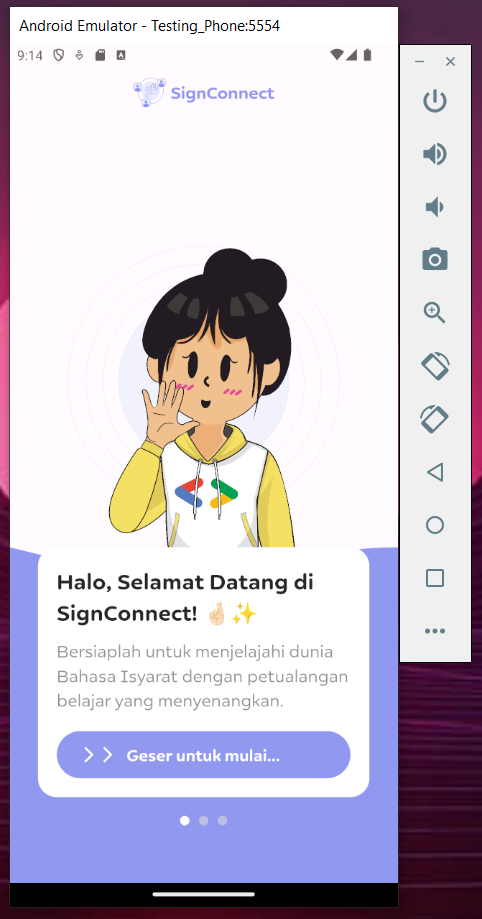
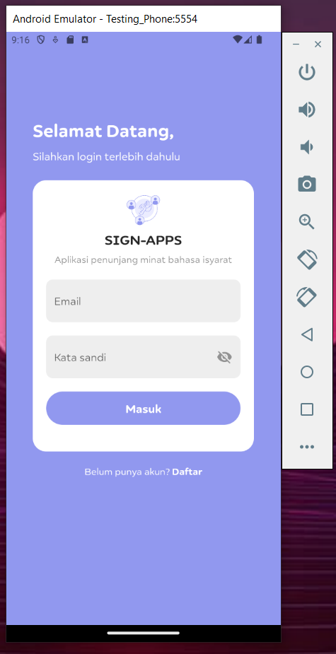
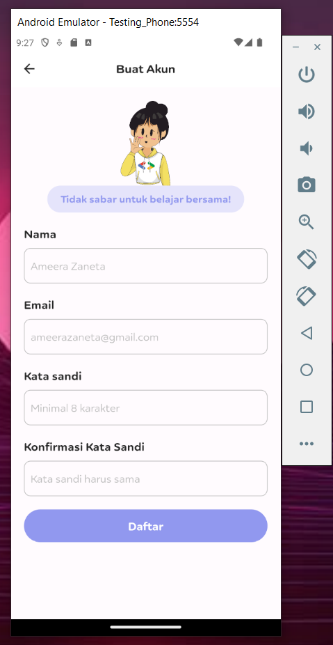
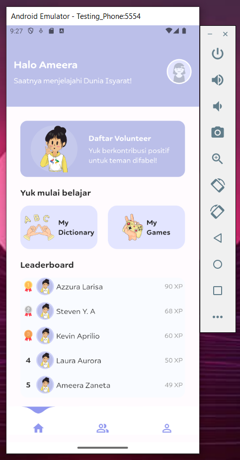
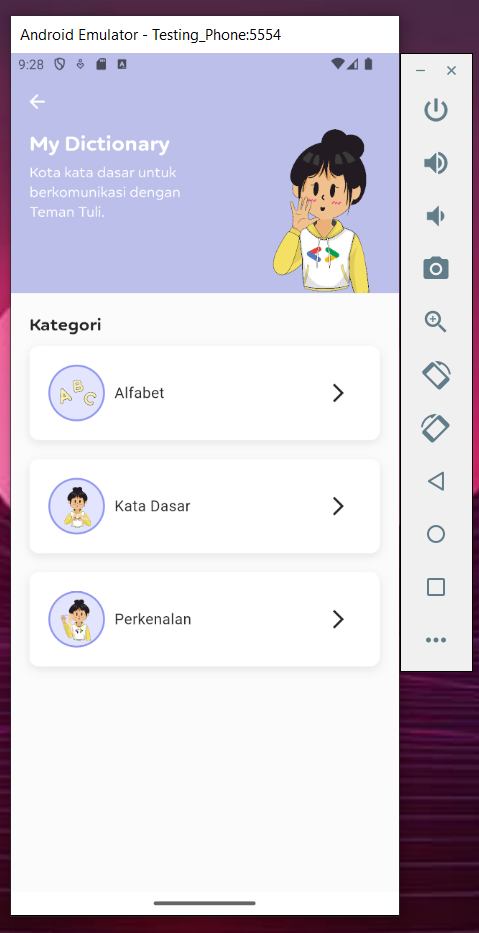
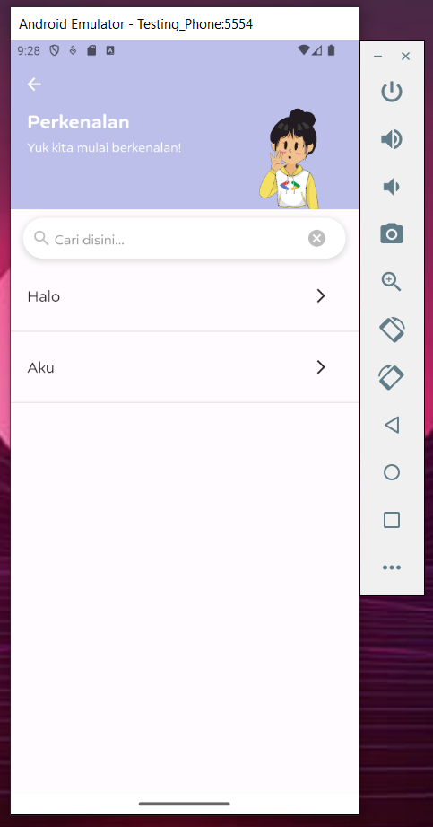
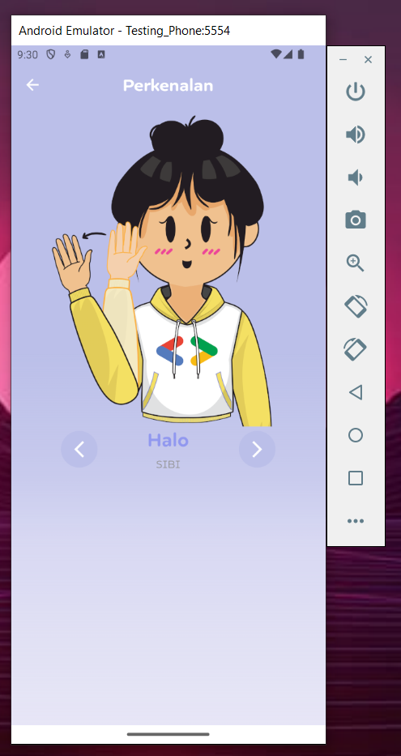
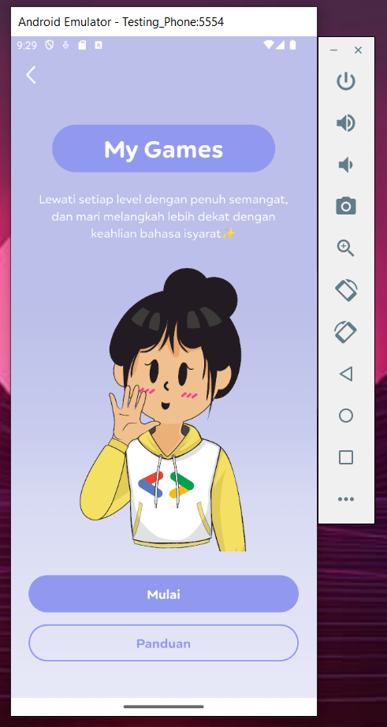
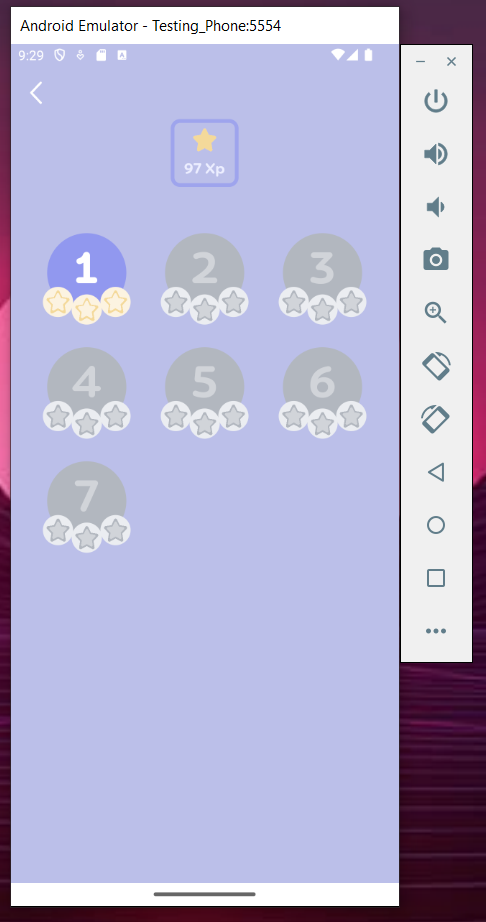

# SignConnect Frontend

**Progress Of The Application**

- [x] Splashscreen screen
- [x] Login Page
- [x] Register Page
- [x] Home Page
- [x] Dictionary Page
- [x] Greetings Game Page
- [x] My Games Page
- [ ] Profile Page
- [ ] Volunteer Page
- [ ] List Of Lemabaga Page
- [ ] Translator Page
- [ ] Profile Page
- [ ] Make A Integration with API

**PROGRESS UP TO 70%**

## 📒 Index

- [SignConnect Frontend](#signconnect-frontend)
  - [📒 Index](#-index)
  - [🔧 Development](#-development)
    - [📓 Tech Stack](#-tech-stack)
    - [📁 File Structure](#-file-structure)
  - [📷 Gallery](#-gallery)
  - [🌟 Credit](#-credit)
  - [🔒License](#license)

## 🔧 Development

Here is a description of our apps development

### 📓 Tech Stack

List all the Tech Stack we use to build the system in this this project.

| No  | Tech                  | Details                                                           |
| --- | --------------------- | ----------------------------------------------------------------- |
| 1   | Flutter               | To build a beautiful and usefull FrontEnd App                     |
| 2   | Google Cloud Platform | To provide all application needs related to server infrastructure |

### 📁 File Structure

Here is our file Structure

```
├───.dart_tool/
├───.git/
├───.idea/
├───android/
├───assets/
│   ├───font/
│   ├───icon/
│   └───image/
├───build/
├───ios/
├───lib/
│   ├───auth/
│   │   ├───login.dart
│   │   └───register.dart
│   ├───controller/
│   ├───custom widget/
│   │   ├───button.dart
│   │   ├───card_dic.dart
│   │   ├───form_login.dart
│   │   ├───form_register.dart
│   │   ├───kata_list_dic.dart
│   │   └───leaderboard.dart
│   ├───screen/
│   │   ├───games_greeting.dart
│   │   ├───home.dart
│   │   ├───intro.dart
│   │   ├───kategori_dic.dart
│   │   ├───kosakata_dic.dart
│   │   ├───level.dart
│   │   ├───list_dic.dart
│   │   ├───profile.dart
│   │   └───splashscreen.dart
│   ├───services/
│   ├───main.dart
│   ├───navbar.dart
│   └───theme.dart
├───linux/
├───macos/
├───test/
├───web/
├───windows/
├───.gitignore
├───.metadata
├───analysis_options.yaml
├───pubspec.lock
├───pubspec.yaml
├───README.md
└───signconnect_frontend.iml
```

| No  | File Name         | Details                                                                            |
| --- | ----------------- | ---------------------------------------------------------------------------------- |
| 1   | lib/screen        | that is a All our screen page                                                      |
| 2   | lib/service       | that is a All service that will be use to integration with our Backend Apps        |
| 3   | lib/custom_widget | that is a All of our custom widget that recently use in this app                   |
| 4   | lib/controller    | that is a All of our controller that recently use to integration with the services |

## 📷 Gallery











## 🌟 Credit

The Member of our team

1. Akbar Fikri Abdillah
2. Firza Aurellia Iskandar
3. Muhammad Rafly Ash Shiddiqi
4. Arif Athaya Harahap

## 🔒License

© Inti Bumi - Hackfest by Google Indonesia 2024
